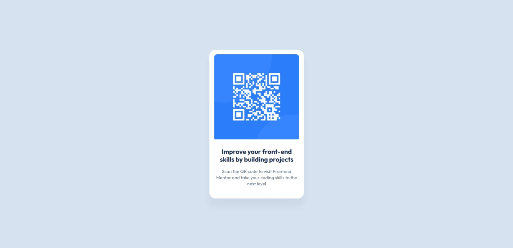

# Frontend Mentor - QR code component solution

hey 👋  
This is my solution to the [QR code component challenge on Frontend Mentor](https://www.frontendmentor.io/challenges/qr-code-component-iux_sIO_H).

## Overview

### Screenshot

### Links

- [live site](https://noonpanirsabzi.github.io/QRCode/)

## My process

### Built with

- Flexbox
- Mobile-first workflow

### What I learned

I was taking a front-end development course when I faced this challenge, and everything felt overwhelming at first. I looked at the design and wondered, "How is this done?" I had this question in my mind but no idea how to solve it. There was a voice inside me that constantly asked, "How do I do this? How do I do that?"

As I continued with my course and learned the basic concepts of HTML and CSS, I began to connect the dots and discover the magic behind web design! I thought to myself,   
"Oh💡, so this is how they create a layout for responsive design"    
"Oh💡, so this is how I can easily center boxes along the vertical axis."   
It felt amazing and now I am much more confident to continue this road. 

